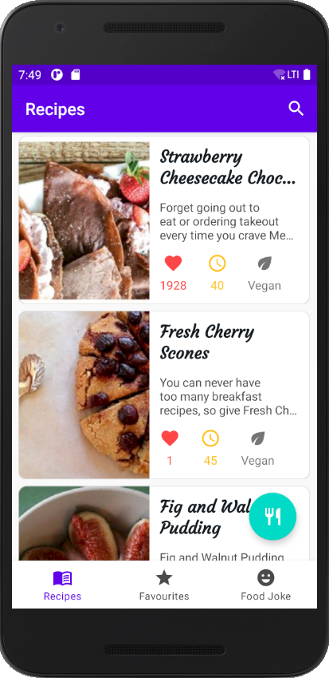
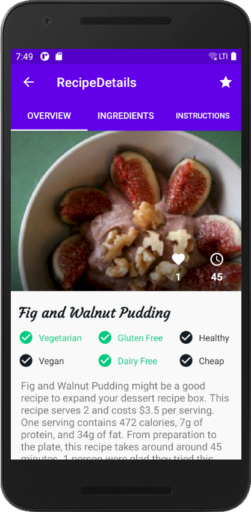
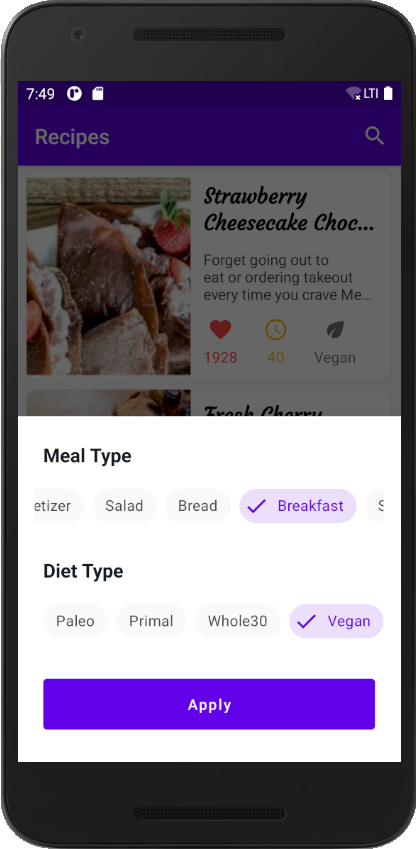
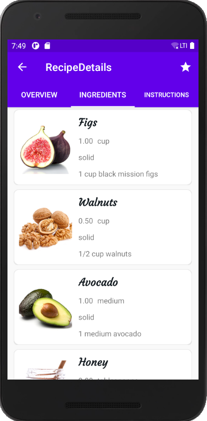

Android проект TodayRecipes для поиска и хранения рецептов на базе стороннего API 
с использованием библиотеки AndroidX Jetpack 
======================================================================

Проект практически полностью выполнен на базе обучающего курса Udemy - [Modern Food Recipes App - Android Development with Kotlin](https://www.udemy.com/course/modern-food-recipes-app-android-development-with-kotlin/), с небольшими корректировками с моей стороны.
Данный проект использует стороннее API - [Spoonacular API](https://spoonacular.com/food-api) для поиска рецептов с различными настройками параметров поиска. 

Данное API использует квоты ежедневного доступа, поэтому возможности ежедневного обращения (для загрузки новых данных) к нему ограничены.  

## Что использовано в проекте  

Проект написан на языке Kotlin и построен с помощью современной библиотеки AndroidX Jetpack с использованием:   

ROOM Database | Dependency Injection - Dagger-Hilt
| Retrofit | Kotlin Coroutines
| Navigation Component | DataStore Preferences
| ViewModel | Data Binding
| LiveData | Flow
| DiffUtil | RecyclerView
| Motion Layout | Material Components
| ShimmerLayout | ViewPager2
| Contextual Action Mode | Modal Bottom Sheet
 и др...

## Внешний вид проекта

   
